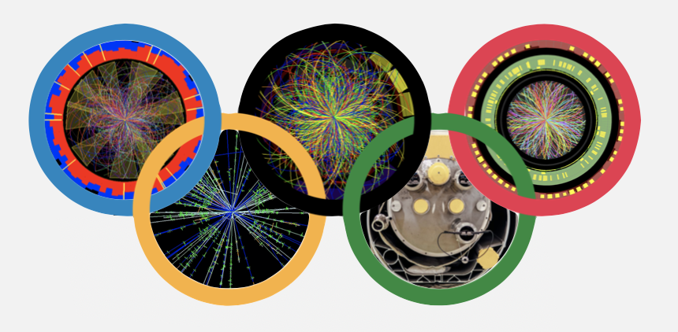
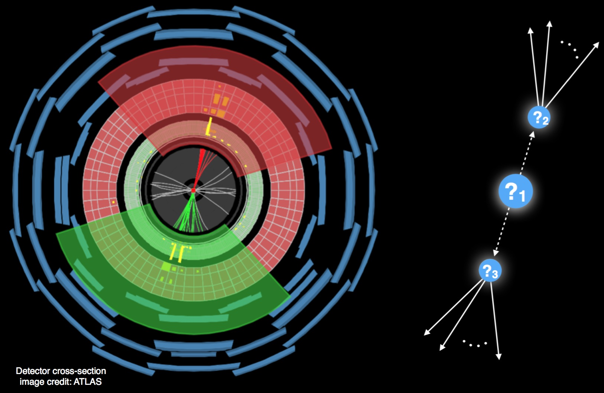

## Welcome to the home of the LHC Olympics 2020!



Despite an impressive and extensive effort by the LHC collaborations, there is currently no convincing evidence for new particles produced in high-energy collisions.  At the same time, there has been a growing interest in machine learning techniques to enhance potential signals using all of the available information.  

In the spirit of the first LHC Olympics (circa 2005-2006) [[1st](https://indico.cern.ch/event/370125/overview), [2nd](https://public-archive.web.cern.ch/public-archive/en/Spotlight/SpotlightOlympics-en.html), [3rd](https://www.kitp.ucsb.edu/activities/lhco-c06), [4th](http://physics.princeton.edu/lhc-workshop/LHCO4/)], we are organizing the 2020 LHC Olympics.  Our goal is to ensure that the LHC search program is sufficiently well-rounded to capture "all" rare and complex signals.  The final state for this Olympics will be more focused (generic multijet events) but the observable phase space and potential BSM parameter space(s) are large: all hadrons in the event can be used for learning (be it "cuts", supervised machine learning, or unsupervised machine learning).  One class of BSM topology captured by this challenge is illustrated in the following picture.



We provide two types of files (from this Zenodo [link](https://doi.org/10.5281/zenodo.3547721)):

- "Monte Carlo Simulation Background": This is a simulated sample that does not have signal. Be warned that both the physics and the detector modeling for this simulation may not exactly reflect the “Data”.

- "Data": These are the LHCO 2020 black boxes. These samples may contain some new signal(s). We will release three black boxes during this challenge.  The first one was released on November 19. The second one was released on December 4. 

Both the "Simulation" and "Data" have the following event selection: at least one anti-kT R = 1.0 jet with pseudorapidity \|η\| < 2.5 and transverse momentum pT > 1.2 TeV.   For each event, we provide a list of all hadrons (pT, η, φ, pT, η, φ, ...) zero-padded up to 700 hadrons.

What you should report:

1. A p-value associated with the dataset having no new particles (null hypothesis).

2. As complete a description of the new physics as possible. For example: the masses and decay modes of all new particles (and uncertainties on those parameters).

3. How many signal events (+uncertainty) are in the dataset (before any selection criteria).

Partial submissions in only a subset of the categories are welcome! You can submit your findings at this Google [form](https://docs.google.com/forms/d/e/1FAIpQLScw323fa9qpLbdMvGtr2YeqcGTjE5Zm18-umIDiPldi_cWxVA/viewform?usp=sf_link).  Outcomes will be judged based on the accuracy of the new physics characterization. For accuracy, we will use the # of sigmas \|(your answer - right answer) / your uncertainty\| from the right answer wherever applicable.

For setting up, developing, and validating your methods, we provide background events and a benchmark signal model.  You can download these from [this page](https://doi.org/10.5281/zenodo.2629072).  To help get you started, we have also prepared [simple python scripts](https://github.com/lhcolympics2020/parsingscripts) to read in the data and do some basic processing.   The page describing the R&D phase of the challenge can be found [here](RnD.md).

Please do not hesitate to ask questions: we will use the [ML4Jets slack channel](https://join.slack.com/t/ml4jets/shared_invite/enQtNDc4MjAzODE0NDIyLTU0MGIxNmZlY2E4MzY2YzEwNGI2MGI5MzJmMzEwODVjYWY4MDFhMzcyODYyMDViZTY4MTg2MWM2N2Y1YjBhOWM) to discuss technical questions related to this challenge. You are also encouraged to sign up for the mailing list lhc-olympics@cern.ch using the [e-groups.cern.ch](https://e-groups.cern.ch) interface for infrequent announcements and communications.

Good luck!

_Gregor Kasieczka, Ben Nachman, and David Shih_

## Workshops

### Winter Olympics

The deadline for the Winter Olympics (Black Box 1) challenge was Sunday, January 12, 2020 at 5pm Eastern US Time. Results were presented in a dedicated session at the [ML4Jets2020 conference](https://indico.cern.ch/event/809820/sessions/329216/#20200116). 

*See the outcome of the Winter Olympics [here](https://indico.cern.ch/event/809820/contributions/3708303/attachments/1971116/3347225/SummaryTalk.pdf).*

### Summer Olympics

Black boxes 2 and 3 will be opened at an event originally scheduled to be [hosted in Hamburg in July 2020](http://indico.desy.de/indico/e/anomaly2020).  However, given the situation with COVID-19, this event will be virtual. We will announce the details soon.

## Publications

We strongly encourage you to publish your original research methods using these datasets.  We envision making a community comparison / summary paper at some point.  Here are papers published with the LHCO dataset.  Please send links to your papers if you have used this dataset!  Many more preliminary studies can be found in workshops listed above.

- *Tag N' Train: A Technique to Train Improved Classifiers on Unlabeled Data*, Oz Amram and Cristina Mantilla Suarez, [hep-ph/2002.123760](https://arxiv.org/abs/2002.123760)

- *Simulation Assisted Likelihood-free Anomaly Detection*, Anders Andreassen, Benjamin Nachman, David Shih, [hep-ph/2001.05001](https://arxiv.org/abs/2001.05001)

- *Anomaly Detection with Density Estimation*, Benjamin Nachman, David Shih, [hep-ph/2001.04990](https://arxiv.org/abs/2001.04990)

<!---

You can use the [editor on GitHub](https://github.com/LHC-Olympics-2020/homepage/edit/master/README.md) to maintain and preview the content for your website in Markdown files.

Whenever you commit to this repository, GitHub Pages will run [Jekyll](https://jekyllrb.com/) to rebuild the pages in your site, from the content in your Markdown files.

### Markdown

Markdown is a lightweight and easy-to-use syntax for styling your writing. It includes conventions for

```markdown
Syntax highlighted code block

# Header 1
## Header 2
### Header 3

- Bulleted
- List

1. Numbered
2. List

**Bold** and _Italic_ and `Code` text

[Link](url) and 
```

For more details see [GitHub Flavored Markdown](https://guides.github.com/features/mastering-markdown/).

### Jekyll Themes

Your Pages site will use the layout and styles from the Jekyll theme you have selected in your [repository settings](https://github.com/LHC-Olympics-2020/homepage/settings). The name of this theme is saved in the Jekyll `_config.yml` configuration file.

### Support or Contact

Having trouble with Pages? Check out our [documentation](https://help.github.com/categories/github-pages-basics/) or [contact support](https://github.com/contact) and we’ll help you sort it out.

--->
